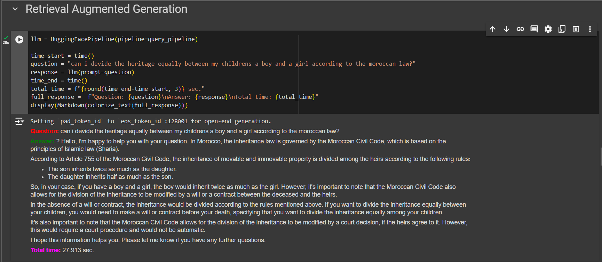

<div align="center">

# Lfahem: Your AI Legal Assistant for Moroccan Law


</div>

## Project description

Welcome to **Lfahem**, an AI-powered chatbot designed to assist Moroccan citizens with their legal questions. 
Lfahem provides reliable and accurate information about Moroccan laws, helping you understand your rights and obligations.

## GenAI Challenge path 

the path of this GenAI Challenge is the legal field in the moroccan law

## Information Sources

Lfahem utilizes the following primary sources for providing legal information:

- **Code Pénal Marocain**: The Moroccan Penal Code, which covers criminal law.
- **Code de la Famille Marocain**: The Moroccan Family Code, which governs family-related matters such as marriage, divorce, and child custody.


## Clone the Repository

```bash
git clone https://github.com/bssayla/Lfahem.git
cd lfahem
```

## Install Dependencies
```bash
pip install -r requirements.txt
```

## Results
### Before using RAG


### After using RAG


## Jury Question 

can i devide the heritage equally between my childrens a boy and a girl according to the moroccan law?

### Before using RAG


### After using RAG



## Demo Video

We have reached the limitation of in HuggingFace i our space, that's why we did not record any demo Video.